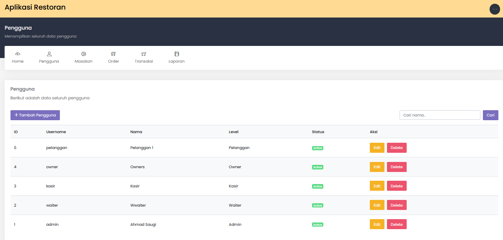
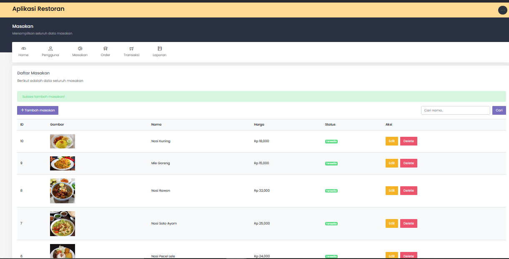

# Laravel Restaurant

Aplikasi restoran menggunakan Laravel dan VueJS

## Installation

Use the package manager (composer) for installing

--composer install
--npm install
--copy .env.example .env
--php artisan key:generate
--php artisan storage:link

# Lakukan dibawah ini jika sudah setting database di .env

--php artisan migrate
--php artisan db:seed

## Account Demo

Username: admin
Password: admin

Username: waiter
Password: waiter

Username: kasir
Password: kasir

Username: owner
Password: owner

Username: pelanggan
Password: pelanggan

--MENU PENGGUNA
  

--MENU MASAKAN
  

--MENU ORDER
  

--MENU PEMBAYARAN
  

--MENU LAPORAN
  
